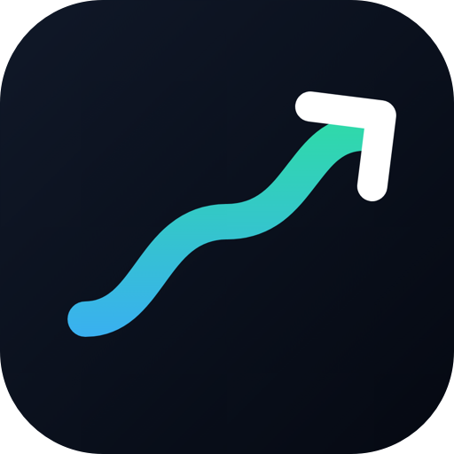

# SovereignFi

**Own your money.** A personal finance app that keeps your data on your device.

---

## Download

Pick your platform. Every download page lists the newest build first.

<table>
<tr>
<td align="center" width="33%">
<h3>🤖 Android</h3>
Android 7.0 or newer  
  
Installs over your current app and keeps your data.
</td>
<td align="center" width="33%">
<h3>📱 iPhone</h3>
iOS 27 or newer  
  
Sideload with AltStore or Sideloadly.
</td>
<td align="center" width="33%">
<h3>💻 Mac</h3>
macOS 26 or newer · Apple Silicon and Intel  
  
Drag to Applications, then right-click → Open.
</td>
</tr>
</table>

On each page, scroll to **Assets** and download the file for your platform. All versions are under [Releases](https://github.com/sovereign-fintracker/SovereignFi-releases/releases).

---

## What you get

- **Everything in one place** — accounts, transactions, budgets, goals, trips, group expenses, a document vault, insights and Wealth Wrap.
- **Native on every platform** — built for Android, and with a Liquid Glass design on iPhone and Mac.
- **Local-first** — your data lives on your device. Cloud sync is available with Pro.
- **Private by design** — Gmail statements are read on your device only and are never sent to any AI service or server.
- **Backups** — local-folder and Google Drive backups on Android, scheduled or manual, with restore.
- **Multi-currency** — add a transaction in another currency while you travel; the rate is saved with the entry.

---

## Install

<b>🤖 Android</b>

1. Download the `.apk` on your Android phone.
2. Open it. If Android asks, allow your browser or file manager to **install unknown apps**.
3. Tap **Install**.

<b>📱 iPhone</b>

This build is **unsigned**, so it can't be installed straight from Safari. You sign it yourself with your own Apple ID, and no paid developer account is needed.

1. Install [AltStore](https://altstore.io) or [Sideloadly](https://sideloadly.io) on your computer.
2. Download the `.ipa` from the iOS release.
3. Open the `.ipa` in AltStore or Sideloadly and sign in with your Apple ID.
4. On the iPhone, trust the profile in **Settings → General → VPN & Device Management**.

> A free Apple ID signs apps for **7 days**. Re-sign the app before it expires. Requires **iOS 27** or newer.

<b>💻 Mac</b>

1. Download the `.dmg` from the macOS release and open it.
2. Drag **SovereignFi** to **Applications**.
3. The first time, **right-click** the app and choose **Open**. The app isn't notarized yet, so macOS asks you to confirm.

> **Google sign-in is not available in the Mac build yet.** Sign in with email. Requires **macOS 26** or newer.

---

## Updates

- **Android** — when a newer version is published, the app shows an **Update available** sheet when you open it. Tap **Update**, then **Install** on the Android prompt. Updates install over your current app and keep your data.
- **iPhone and Mac** — download the newest release from the links above and install it over the current app.

---

## Requirements

| Platform | Minimum | Format | Signing |
| --- | --- | --- | --- |
| Android | Android 7.0 | `.apk` | Signed |
| iPhone | iOS 27 | `.ipa` | Unsigned, sign with your Apple ID |
| Mac | macOS 26 | `.dmg` | Ad-hoc, not notarized |

---

## Beta notice

This is an early beta. Expect rough edges while bugs are being fixed.

- Cloud sync is a Pro feature. Free accounts keep everything on the device.
- To read statements with Gemini, add your own free Gemini API key in **Smart Features**.
- The iPhone and Mac builds are first releases and don't have every Android feature yet.

---

SovereignFi · Own your money

